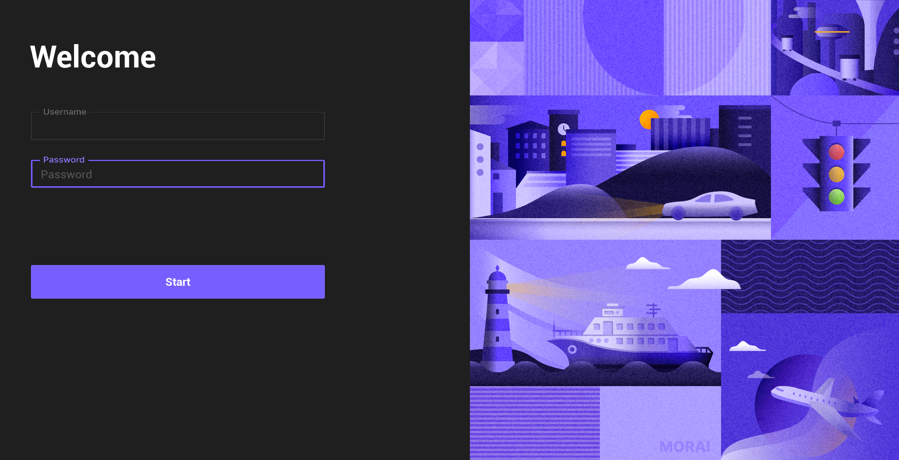

# Installation
This section describes the system requirements for installing MORAI SIM: Air and how to run it.

---

## System Requirements
The OS environment in which MORAI SIM: Air can run is as follows.

 - **Windows** 10 or higher
 
 - **Ubuntu** 18.04 LTS or higher

ℹ️  NOTE   
A version for <b>Ubuntu (Linux)</b> is under development.

 
To install and run MORAI SIM: Air, the user's system should meet the minimum or recommended specifications.

### Minimum specifications
To use the basic functions of MORAI SIM: Air, the following system requirements should be satisfied.
> - CPU: Intel i5-9600KF or AMD Ryzen 5 3500X
- RAM: DDR4 16GB
> - VGA: NVIDIA GeForce RTX 2060 Super

### Recommanded specifications
To use multiple sensors in MORAI SIM: Air, the system requirements below should be satisfied.
> - CPU: Intel i9-9900K or AMD Ryzen 7 3700X or higher
 - RAM: DDR4 64GB (or higher
> - VGA: NVIDIA GeForce RTX 2080 Ti or higher

## Running MORAI SIM: Air
Install and run MORAI SIM: Air in the following order.

### Step 1: Download MIRAI SIM launcher
Download the MORAI SIM Launcher package in the path below according to the user's OS environment.

- Windows: ' Attachment required'
  

### Step 2: Run the launcher program
1) Run **UELauncher.exe** from the downloaded package path.  
   
<!--  -->

2) On the launcher execution screen as shown below, click **Start** after entering the **Username** and **Password** guided by MORAI.

<!--  -->

✅  TIPS   
For details regarding Username and Password information, please contact the <a href="mailto:hsjeon@morai.ai" target="_blank">MORAI project manager</a>.

### Step 3: Select Map and Aircraft
After launcher execution is completed, the following **Map and Vehicle** screen appears.  
After selecting both the map and aircraft model to be used in the simulator, click Start to run the simulator.

The **Runway {number}** option of ** Select Map** is a spawn point setting that sets the runway facing the direction of '{number}+0' degrees.  
**Ex**) If you select **Runway 3**, the spawn point is the runway facing a 30 degree direction.

✅  TIPS   
The <b>start</b> button does not appear unless either the map or aircraft model is selected.

### Step 4: Check the simulator run
When the MORAI SIM:Air simulator is normally executed, the following simulator execution screen appears.

