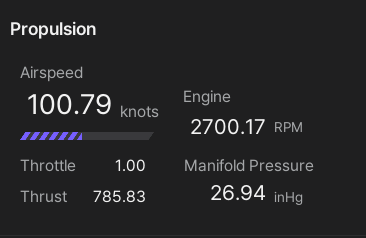

# User Interface
This section discribes an overview of the MORAI SIM: Air user interface (UI) and provides the detailed information on each UI component.

---

## UI Overview

The MORAI SIM: Air UI is designed to provide users with easy access to all necessary information and controls, allowing for a realistic and immersive simulation experience.  

## Default UI
The default UI that appears as soon as you enter the simulater for the first time consists of the following three parts, centering on the map and aircraft selected in the previous step.

### 1] Network and Sensor Settings
This menu is located in the upper left corner of the screen and provides access to the core features provided by the simulator, such as networks and sensors.

### 2] Environment Settings
Environment settings exist at the top right of the screen, and select the weather and time zone that determine the background and illumination of the simulator.

### 3] Flight Instruments
The flight instrument and provides real-time flight information such as the current heading, air speed, attitude, and altitude of the aircraft.

## Aircraft Info UI
The aircraft information UI shows the aircraft control mode and the current flight status and steering input values of the aircraft, such as speed, air pressure, control surface and attitude, in detailed numerical values.  

If you click the mouse on the Ego aircraft, the aircraft information window appears on the right side of the simulator screen as shown below.

### 1] Aircraft Control Mode
Displays the mode to control the Ego aircraft with **Manual Control Mode** and **Network Control Mode**.

### 2] Proopulsion
Displays engine RPM, air speed (knots), thrust according to throttle control and manifold pressure (inHg) according to  aircraft altitude.

### 3] Flight Control
Displays the attitude value according to the flight control surfaces and trim control, and the altitude and speed values ​​according to the vertical and horizontal movement of the aircraft in detailed numerical values.

The attitude value of an aircraft can be displayed based on the control surface and trim control. The control surfaces, such as the ailerons and elevators, are used to control the roll, pitch, and yaw of the aircraft, while the trim control is used to adjust the neutral position of these surfaces. The altitude and speed values of the aircraft can be displayed in detailed numerical values based on its vertical and horizontal movement. 