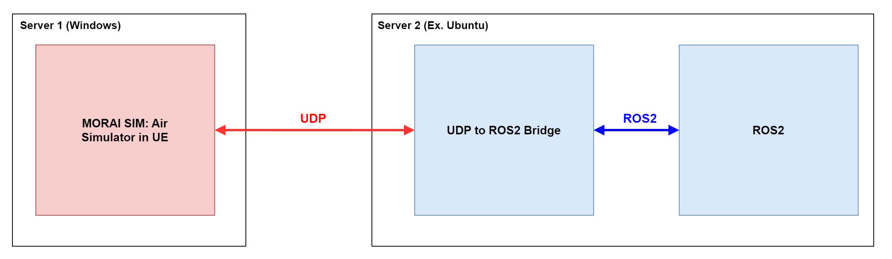
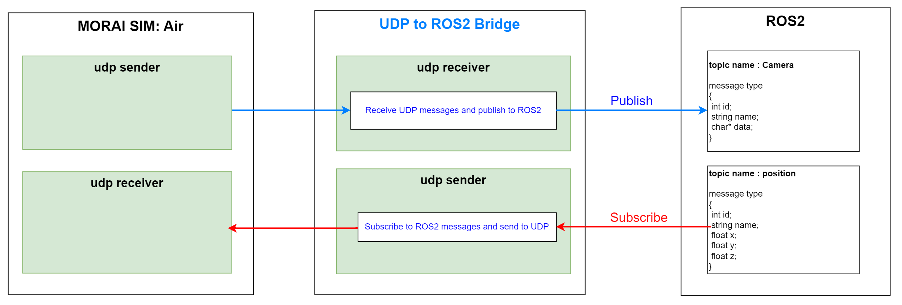
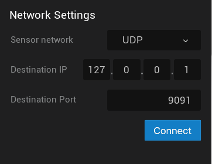
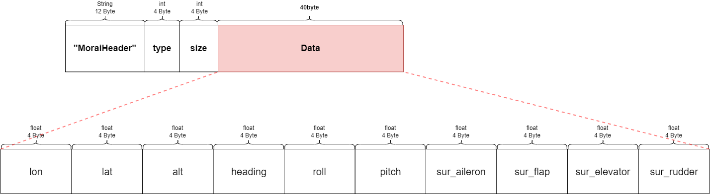
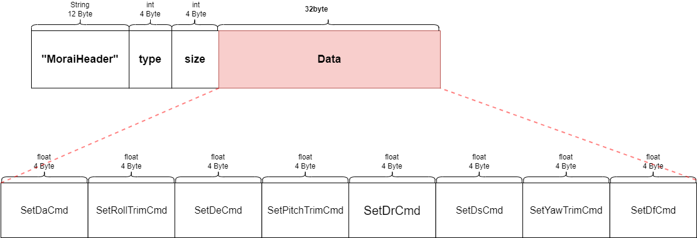
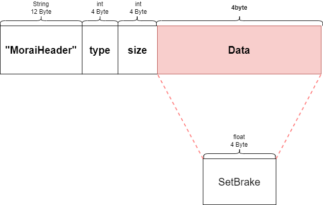
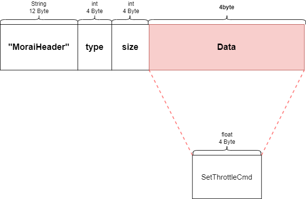

# Network Settings
This section describes the configuration of the network environment of MORAI SIM: Air, the setting method for data communication between external systems, and sending/receiving messages.

---

## Supported communication method
MORAI SIM: Air supports UDP and ROS2 for network communication between the simulator and external systems.

[UDP](https://en.wikipedia.org/wiki/User_Datagram_Protocol) is a widely used network protocol for transmitting data over the internet, while [ROS2 (Robot Operating System 2)](https://docs.ros.org/en/rolling/index.html) is a popular middleware for robotics and automation applications. <br>
The MORAI SIM: Air simulator allows for sending sensor data and receiving aircraft control messages using either UDP or ROS2 communication methods. 

To communicate with MORAI SIM: Air, <br>
Depending on the simulator's message transmission/reception method, the following network settings are required.

<figure>
    
    <figcaption style="padding-top: 10px;"><b> Figure 1. Network communication method supported by MORAI SIM: Air</b></figcaption>
</figure>

- MORAI SIM: Air sends sensor data to an external system
    1. **UDP Network Settings** in each sensor model in the simulator
    2. Receive UDP messages and publish to ROS2 using **UDP to ROS2 Bridge**

- MORAI SIM: Air receives aircraft control messages from an external system
    1. **UDP Network Settings** provided by the simulator (Subscriber IP/Port setting)
    2. Subscribe to ROS2 messages and them over UDP using **UDP to ROS2 Bridge**

The UDP to ROS2 Bridge serves to connect data between the UDP-based simulator and the ROS2 system by receiving and transmitting UDP signals and issuing and subscribing to ROS2 as shown below.

<figure>
    
    <figcaption style="padding-top: 10px;"><b> Figure 2. Role of 'UDP to ROS2 Bridge'</b></figcaption>
</figure>

<div markdown="span" class="bs-callout bs-callout-danger">
⚠️  <span class = "dan-calloutTitle"> WARNING </span> <br>
The current simulator does not provide direct support for transmitting/receiving ROS2 messages. Therefore, <b>UDP to ROS2 Bridge</b> should be used for ROS2 communication with an external system.
</div>

## Receiving Aircraft Control Messages
When the simulator receives control messages by ROS2 communication, <br>
Configure the ROS2 to UDP communication environment and set the network of the simulator in the order below.

### Step 1: Subscribe to ROS2 messages

For this step, you need to install and run **UDP to ROS2 Bridge**.

<div markdown="span" class="bs-callout bs-callout-success">
✅ <span class = "suc-calloutTitle"> TIPS </span> <br>See the <a href="https://morai.atlassian.net/wiki/external/1372881223/NzI2NTk2NWU0ODBjNDJmYTkwOGRjZDBiMWEwMmZhMzI">UDP to ROS2 Bridge User Guide</a> provided separately.
</div>

### Step 2: UDP network setting in the simulator
#### 1) Activate the network menu
Click **Network** in the top left menu as shown below.


#### 2) Configure Host IP/Port
The method of receiving aircraft control messages in the simulator consists of **GHOST MODE** and **EXTERNAL CTRL** protocol.

Configure the Host IP/Port as below to operate the aircraft in **GHOST MODE** by receiving external control messages.

- Host IP: Enter the IP of the host PC running the simulator
- Host Port: Enter the Port of Host PC

Host IP/Port configuration method for **EXTERNAL CTRL** protocol is the same as above.

#### 3) Network connection
Click **Connect** at the bottom **PROTOCOL_SUB_GHOSTMODE** or **PROTOCOL_SUB_EXTERNALCTRL**. <br>
Then, it enters into a standby state in which a control message can be received.

### Step 3: Send messages from external server
Send a message from the external server to the simulator using UDP to ROS2 Bridge.

 - Send coordinates by playing rosbag file
 - Send UDP packet

UDP messages received by each mode are as follows.

  - GHOST MODE:
    - `Cirrus_tx`
  - EXTERNAL CTRL: 
    - `CIRRUS_CONTROL_POSITION`,   // 101  SIM -> JSBSim
    - `CIRRUS_BRAKING`,            // 102
    - `CIRRUS_ENGINE`,             // 103

<div markdown="span" class="bs-callout bs-callout-success">
✅ <span class = "suc-calloutTitle"> TIPS </span> <br>
For details on the types and detailed structure of UDP messages received in GHOST MODE or EXTERNAL CTRL, see the <a href=#udp-recieve-messages>UDP Recieve Messages</a> section.
</div>

## Sending Sensor Messages

### Step 1: Senosr network settings in the simulator

#### 1) Place sensors on the aircraft
<div markdown="span" class="bs-callout bs-callout-success">
✅ <span class = "suc-calloutTitle"> TIPS </span> <br>
For details on how to place the sensor, see the <a href="https://morai.atlassian.net/wiki/external/1372881223/NzI2NTk2NWU0ODBjNDJmYTkwOGRjZDBiMWEwMmZhMzI">Sensor Settings</a> part.
</div>

#### 2) Configure Destination IP/Port
Configure Destination IP/Port for UDP network in **Network Settings** at the bottom of the sensor setting window.



- **Destination IP** and **Port**: 
    - Enter the IP and port of the target server that transmits sensor data in the simulator.
    - In case of ROS2 communication in the server, enter the IP and Port of the server where UDP to ROS2 Bridge is installed.

#### 3) Network connection
Click **Connect** at the bottom of **Network Settings**. <Br>
Then, it enters into a standby state in which sensor messages can be transmitted.

### Step 2: Publishing to ROS2
For this step, you need to install and run **UDP to ROS2 Bridge**.

<div markdown="span" class="bs-callout bs-callout-success">
✅ <span class = "suc-calloutTitle"> TIPS </span> <br>See the <a href="https://morai.atlassian.net/wiki/external/1372881223/NzI2NTk2NWU0ODBjNDJmYTkwOGRjZDBiMWEwMmZhMzI">UDP to ROS2 Bridge User Guide</a> provided separately.
</div>

## Network Message Specifications
This section describes details such as the type and format of messages received and transmitted by MORAI SIM: Air as described above.

### UDP Recieve Messages
The data structure and packets for each UDP message sent from the external Cirrus system to MORAI SIM are as follows.

#### Cirrus_tx

``` python
struct Cirrus_Tx
{
    float lon;              // deg
    float lat;              // deg
    float alt;              // ft
    float heading;          // deg
    float roll;             // deg
    float pitch;            // deg
    float sur_aileron;      // [-1 ~ 1]
    float sur_flap;         // [-1 ~ 1]
    float sur_elevator;     // [-1 ~ 1]
    float sur_rudder;       // [-1 ~ 1]
};
```
<Br>


#### Cirrus_ControlPosition

``` python
struct Cirrus_ControlPosition
{
    float SetDaCmd;             // get_aileron              -1 ~ +1
    float SetRollTrimCmd;       // get_aileron_trim         (-0.1 ~ +0.1)
    float SetDeCmd;             // get_elevator             -1 ~ +1
    float SetPitchTrimCmd;      // get_elevator_trim        (-0.1 ~ +0.1)
    float SetDrCmd;             // get_rudder               -1 ~ +1                 
    float SetDsCmd;             // get_rudder               -1 ~ +1                 
    float SetYawTrimCmd;        // get_rudder_trim          (-0.1 ~ +0.1)
    float SetDfCmd;             // get_flaps                0 ~ 1
};
```
<Br>


#### Cirrus_Braking

``` python
struct Cirrus_Braking
{
    float SetBrake;             // Left + Right             0~1   
};
```
<Br>


#### Cirrus_Engine
``` python
struct Cirrus_Engine
{
    float SetThrottleCmd;      // get_throttle(i)           0~1
};
```
<Br>
